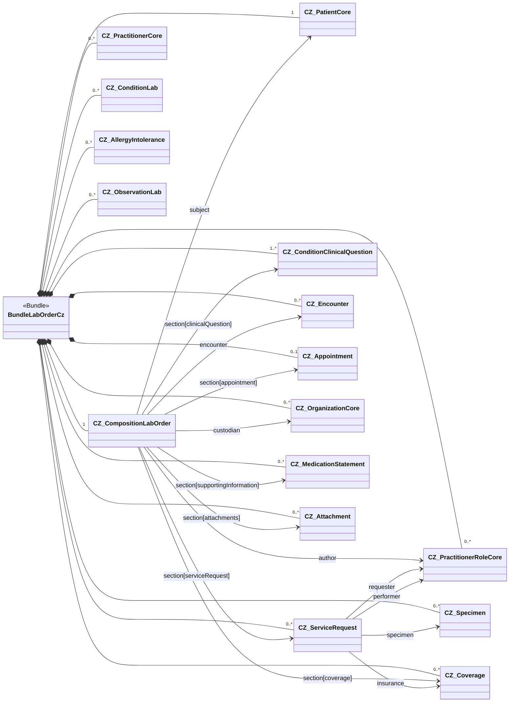

The following page contains notes on implementing the laboratory order. They relate to creating the composition (`CZ_CompositionLabOrder`), the bundle (`BundleLabOrderCz`) and populating the related profiles with the appropriate data.

### Overview

The laboratory order is represented as a FHIR `document` Bundle whose first entry is `CZ_CompositionLabOrder` and which then contains all resources referenced by the composition and its sections (see the [$document operation](https://www.hl7.org/fhir/composition-operation-document.html)).

### Description of the CZ_CompositionLabOrder content


